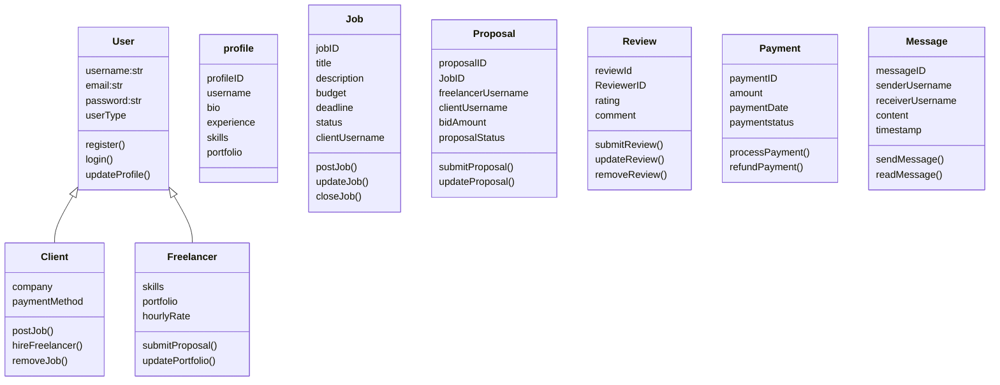

# DesignMermaidCharts

## CLASS DIAGRAMS

```mermaid
classDiagram
    User<|--Client    
    User<|--Freelancer
    class User{
        username:str
        email:str
        password:str
        userType
        register()
        login()
        updateProfile()
    }
    class profile{
        profileID
        username
        bio
        experience
        skills
        portfolio
    }

    class Client{
        company
        paymentMethod

        postJob()
        hireFreelancer()
        removeJob()
    }
    class Freelancer{
        skills
        portfolio
        hourlyRate

        submitProposal()
        updatePortfolio()
    }

    class Job{
        jobID
        title
        description
        budget
        deadline
        status
        clientUsername
        postJob()
        updateJob()
        closeJob()
    }

    class Proposal{
        proposalID
        JobID
        freelancerUsername
        clientUsername
        bidAmount
        proposalStatus

        submitProposal()
        updateProposal()

    }
    class Review{
        reviewId
        ReviewerID<!-- clientFreelancer -->
        rating
        comment
        submitReview()
        updateReview()
        removeReview()
    }
    class Payment{
        paymentID
        amount
        paymentDate
        paymentstatus

        processPayment()
        refundPayment()
    }
    class Message{
        messageID
        senderUsername
        receiverUsername
        content
        timestamp

        sendMessage()
        readMessage()
    }
```
